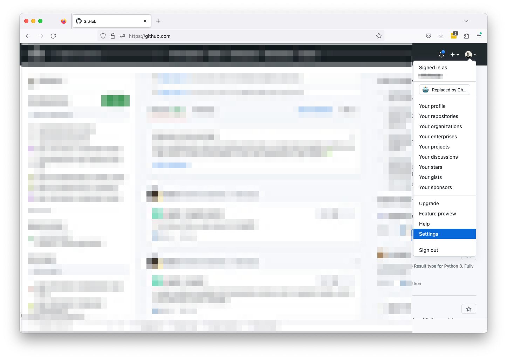
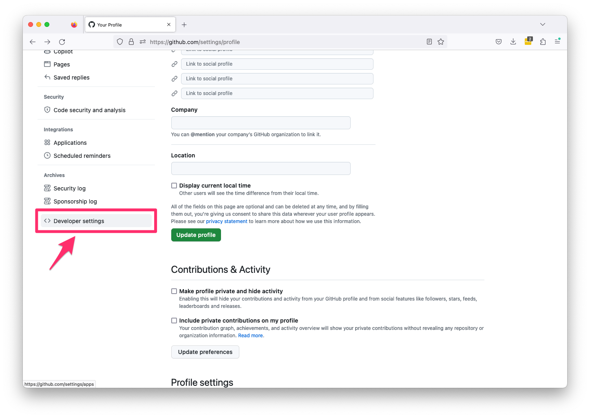
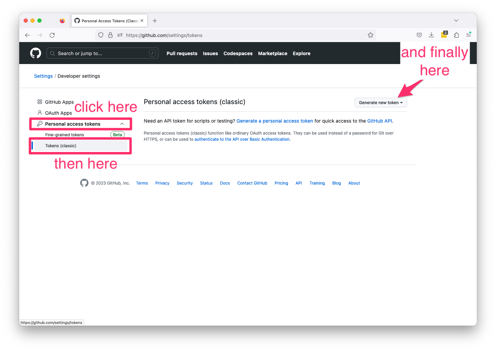
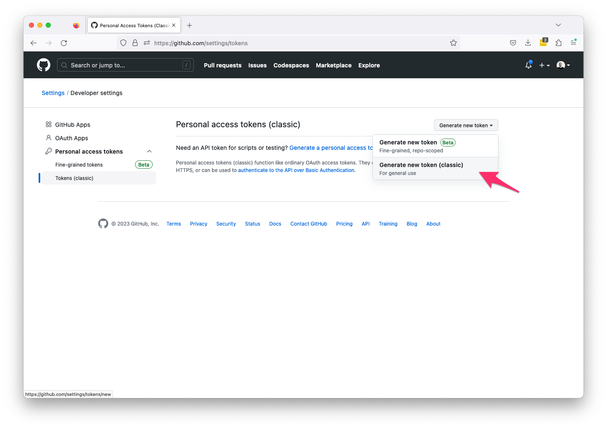
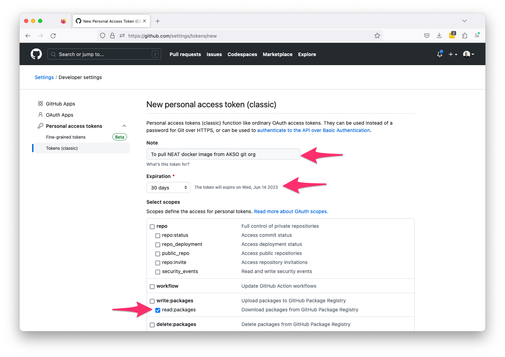
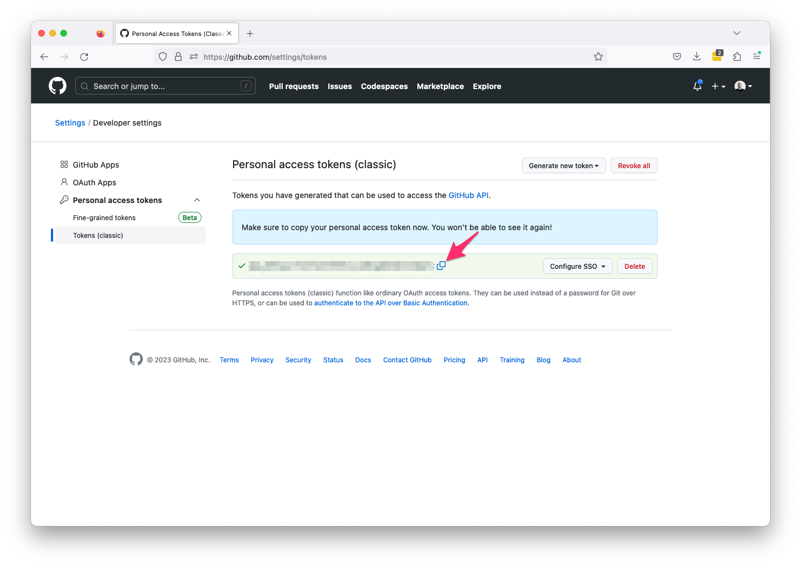
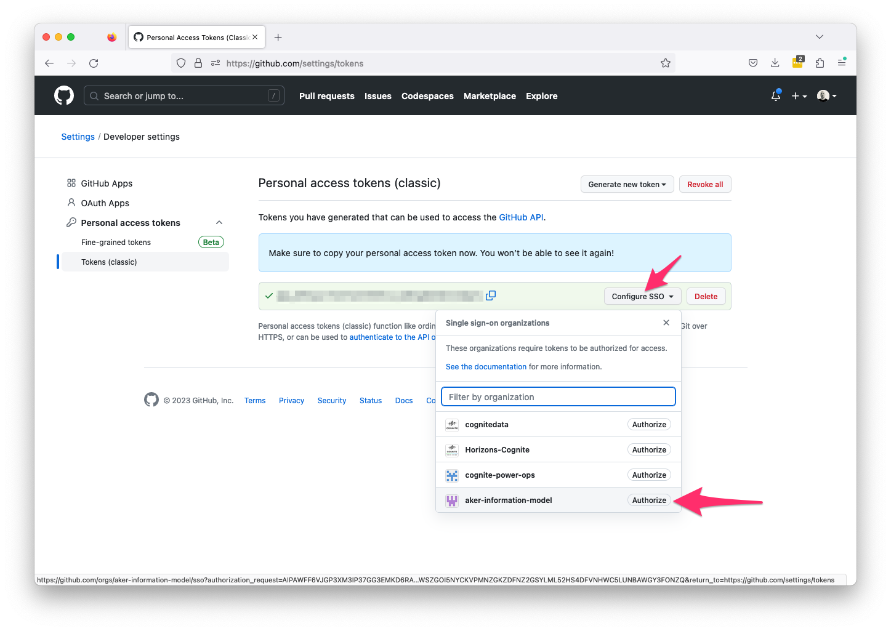
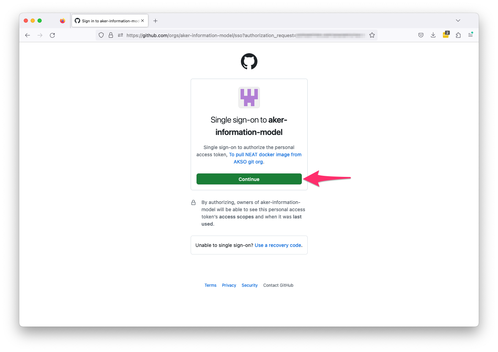
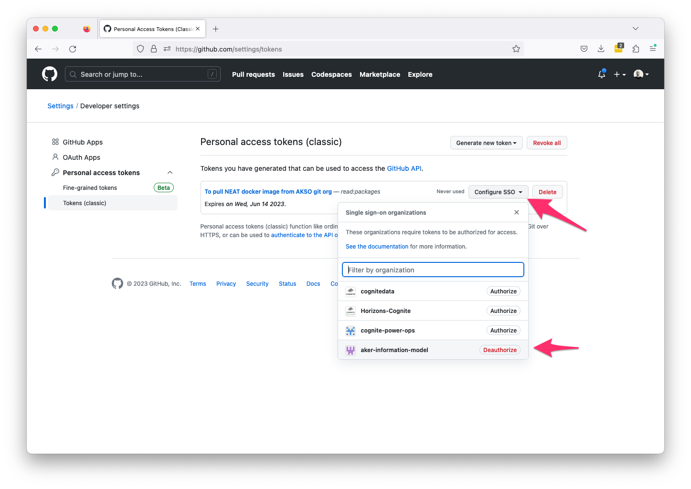

# NEAT Config

Docker image tailored for AKSO needs


Follow [instruction](https://docs.github.com/en/enterprise-server@3.4/authentication/keeping-your-account-and-data-secure/creating-a-personal-access-token) and create Github Personal Token. In short we provide quick visual steps on how to generate Github Personal Token here as well.

1. Logging to Github, click at account image and select `Settings`


2. Under setting scroll to the bottom of the page and click on `Developer settings`


3. Click on `Personal access tokens`, then on `Tokens (classic)` and finally on `Generate new token`


4. Once menu appears click on `Generate new token (classic)


5. Give this token some memorable note. Ideally you will keep `Expiration` as is, generally speaking do not set it to more than 90 days. Set token to have only `read:packages` scope, we simply want to allow pulling of NEAT docker image not writing!


6. Copy created token and story it somewhere safe (e.g., LastPass)


6. Click on `Configure SSO` and select `aker-information-model` organization


7. When presented with new page click `Continue`


8. Once the previous step is completed, when you check `SSO` you should be see `deauthorized` next to `aker-information-model`



The above config needs to be done once ever number of days you set for token expiration.
The rest of the process is done via terminal, and expects that you have installed Docker and git on your machine.

In terminal execute following commands (replace necessary value in the commands):

```
export GIT_PERSONAL_TOKEN=insert_your_personal_token
echo $GIT_PERSONAL_TOKEN | docker login ghcr.io -u inser_your_git_name --password-stdin
docker pull ghcr.io/aker-information-model/neat:latest
```

If this was successful proceed and clone this repository to your local machine:

```
git clone https://github.com/aker-information-model/neat-config.git
```

Go to subdirectory of the cloned repository and make folder `data`:
```
cd neat-config/docker
mkdir data
```

Create docker volume where NEAT data will be stored and link it to `data` folder :
```
docker volume create --name neat-volume --opt type=none --opt device=${PWD}/data --opt o=bind
```


Finally, start `NEAT` by executing command:

```
docker-compose up -d
```
