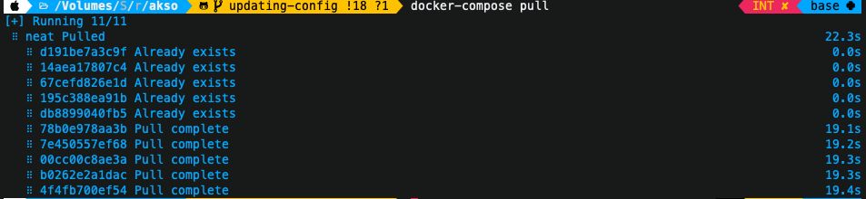
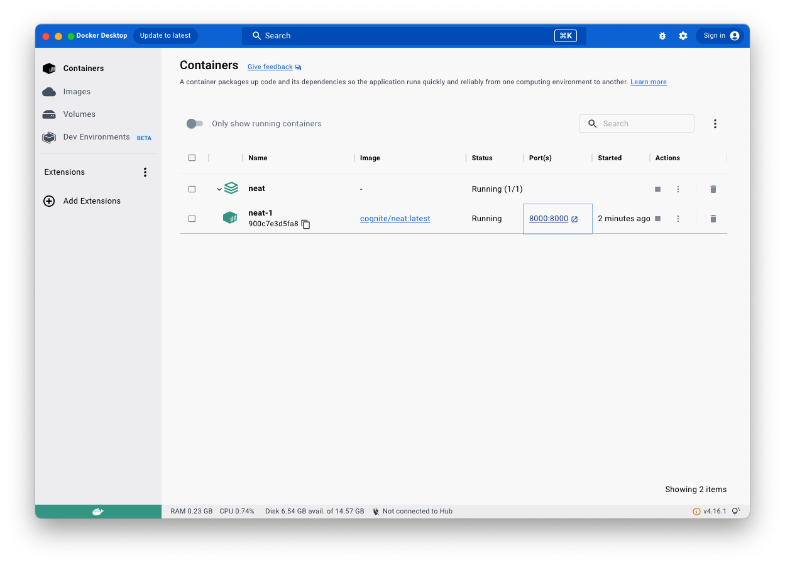
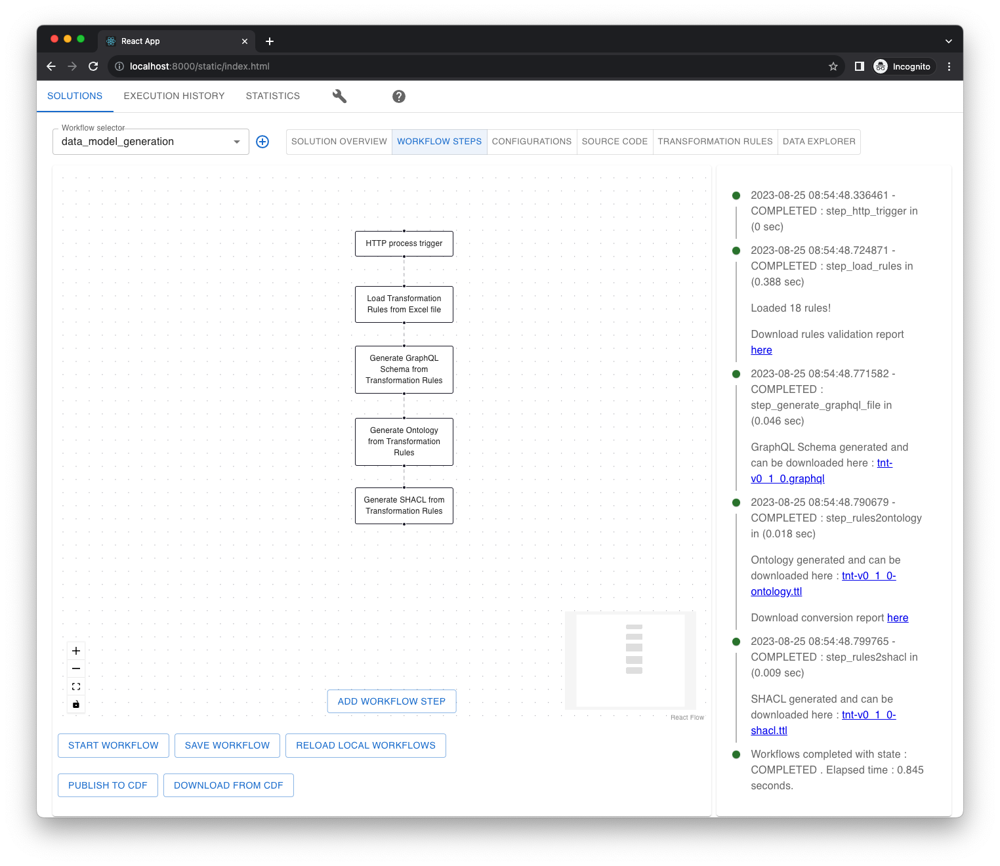

# NEAT Config

## Prerequisite
1. Docker or Docker Desktop installed on machine
2. Github account with access rights to [Aker Information Model](https://github.com/aker-information-model)
3. Not afraid to make mistake
4. Not afraid to use terminal


## Getting NEAT on your machine
Steps to set up `neat` on your machine:

1. Download [docker-compose.yaml](./docker-compose.yaml) file and place it in the folder you can easily reach out through terminal (aka command prompt) and using mouse. Suggestion, make folder called `neat` on your desktop and put `docker-compose.yaml` in there.

2. Use terminal and navigate to folder under which you have saved `docker-compose.yaml` and execute following command:

```
docker-compose pull
```

You should see something like this:


This will command downloads latest version of `neat` [docker image from Docker hub](https://hub.docker.com/r/cognite/neat).


> This step needs to be anytime you want to download latest version of neat image from the Docker hub!

3. Assuming you are still in the folder where you saved `docker-compose.yaml` create folder called `data` :

```
mkdir data
```
> This step needs to be done only once!


4. Continuing from the previous step execute the following command that will start neat on you computer:

```
docker-compose up -d
```

If everything goes well, you should be able to see `neat` container running in Docker Desktop:



Now you can access `neat` through any browser, just navigate to [http://localhost:8000/](http://localhost:8000/)




## Setting up Github Personal Access Token


Video below shows steps how to create Personal Access Token which is used by `neat` to download `TransformationRules` from [Aker Information Model](https://github.com/aker-information-model) organization


https://github.com/aker-information-model/neat-docker/assets/35523348/f1a9f95a-3588-45fa-bcbd-b03a6d186cac
